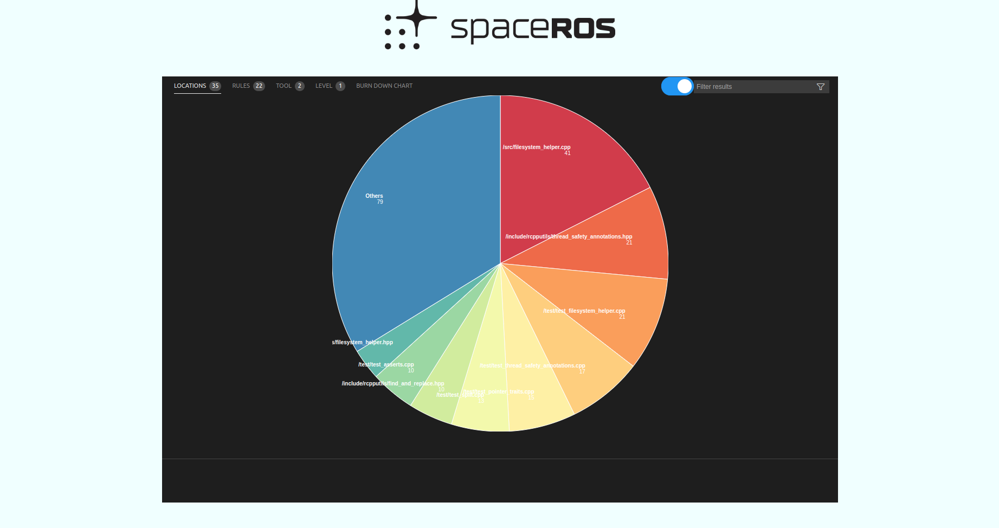

# SpaceROS  dashboard

A [Visual Studio Code](https://code.visualstudio.com/) [extension] (WIP), and a standalone web application for viewing and analysing [SARIF](https://sarifweb.azurewebsites.net/) logs.

## Usage

## Inside a SpaceROS image
 - Run a SpaceROS docker image from [here](https://github.com/space-ros/docker-images/)
 - Attach Vscode to the running docker container (you will need the Vscode docker extention installed for that)
 - Install SpaceROS dashboard in the Vscode window running inside the docker container
 - Use the dashboard by using using the command `spaceRos.showPanel` (using f1 then using "spaceros" as a keyword also works)
## Standalone web application [No actively supported right now]
### Prerequest
Node v16 or higher is recommended.

### Installtion 
`npm run prestart`
### Run
| Command | Comments |
| --- | --- |
| `npm run server` | Run the `Panel` standalone at `http://localhost:8000`. Auto-refreshes. |

Consuming sarif files (temp solution until connected with colcon)

The build results should be placed in `samples/commit_<commit_index>`
The final commit results is viewed, and the results of the other commits are consumed to line the burndown chart.

At the moment only three `sarif` results are proccesed `['cpplint.sarif', 'cppcheck.sarif', 'clang_tidy.sarif']`, add more to the array in `index.js` 

TODO:

- [ ] Automate colcon connection to dashboard
- [ ] Automate files to be proccesed
- [ ] Forward port the standalone application changes to the VSCode extention
- [ ] Make the burndown chart more flex (configurable points per week, different points for each issue type) 
 